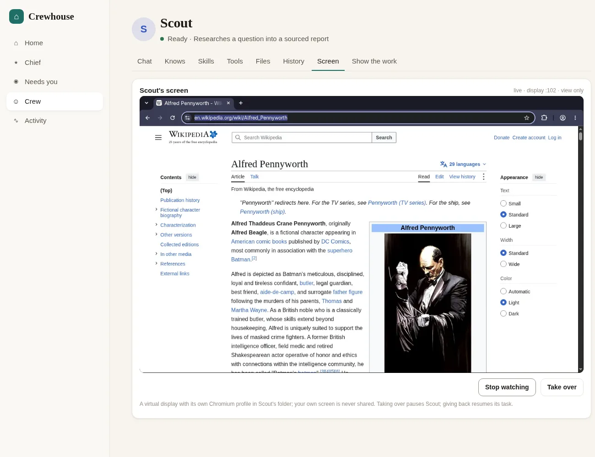
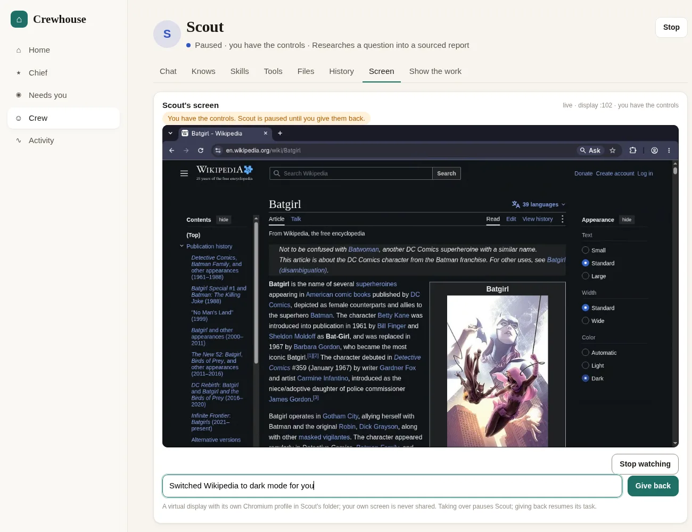
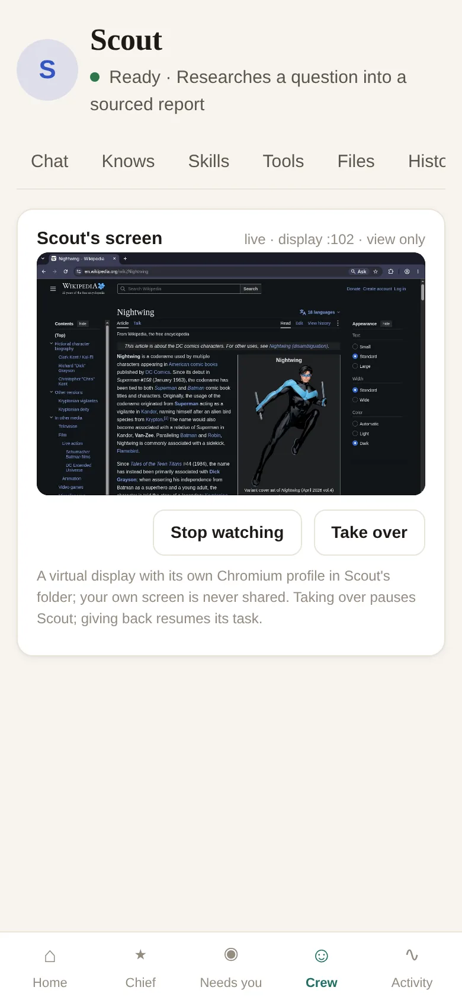
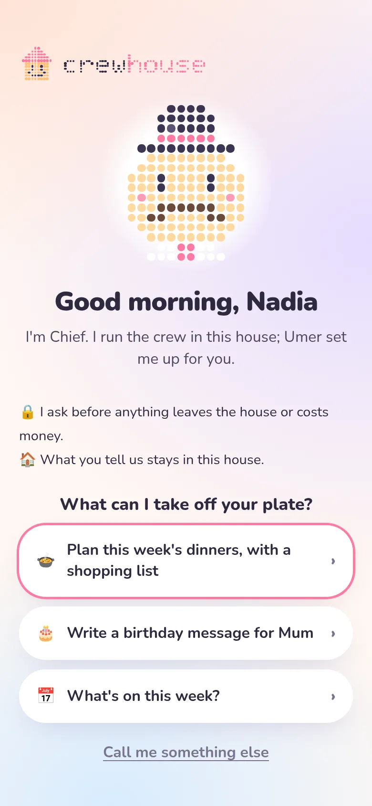
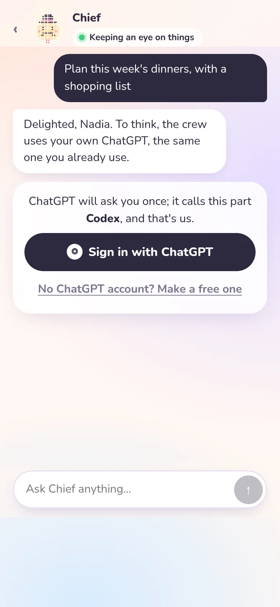
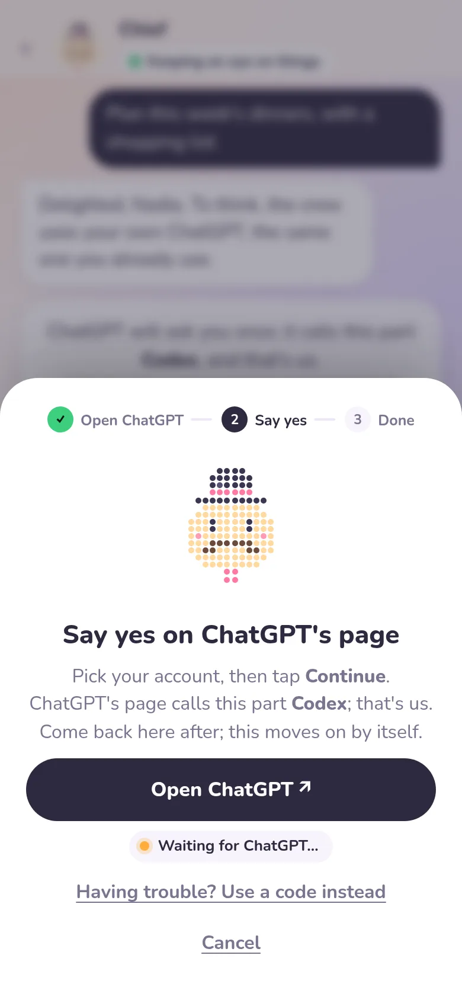
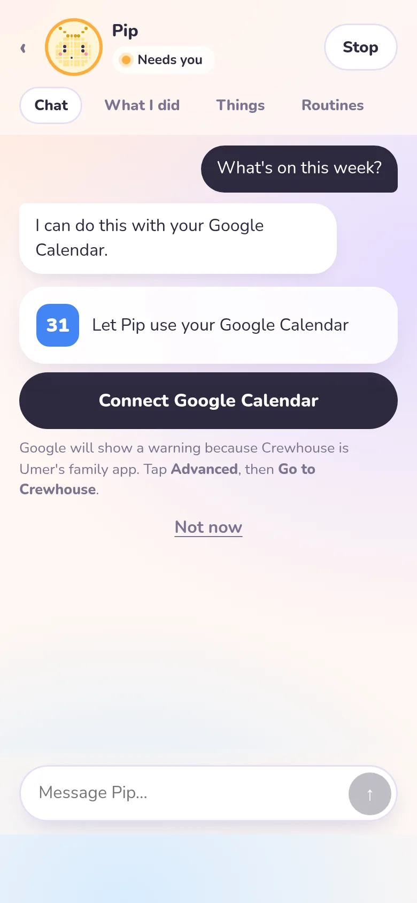
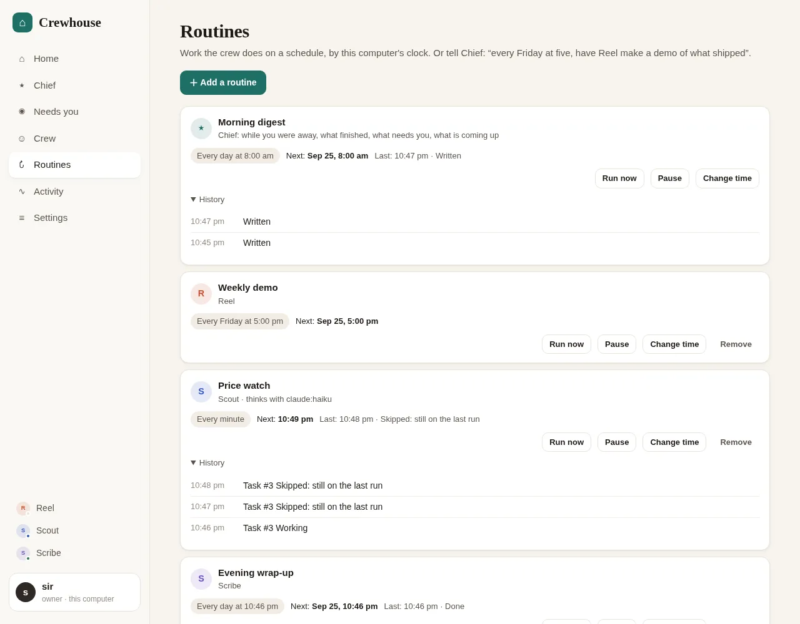
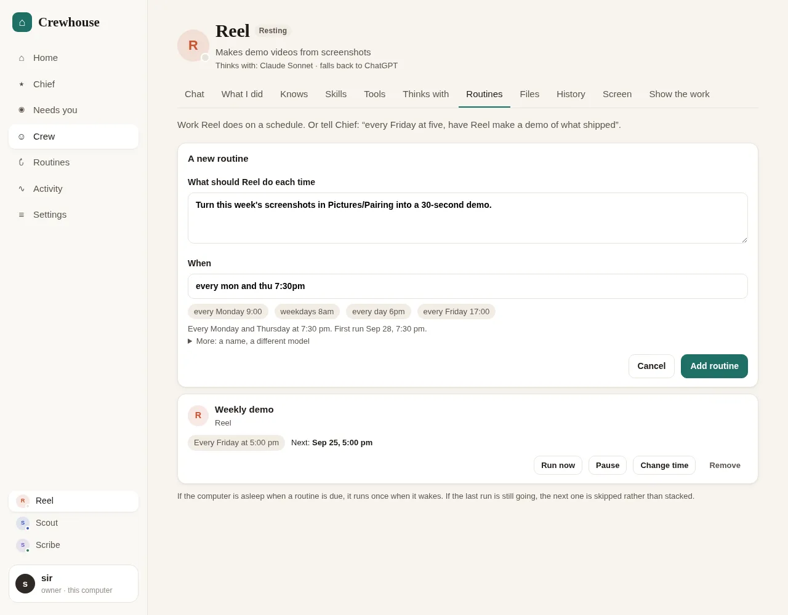
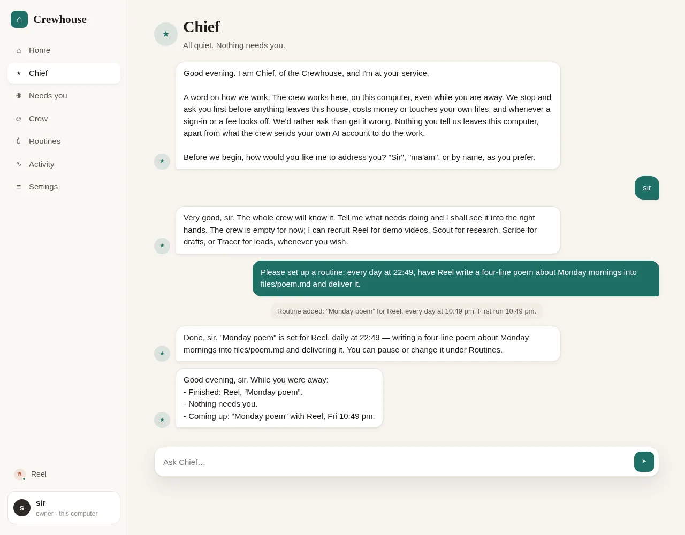

# Crewhouse

[](https://github.com/umeranjum17/crewhouse/actions/workflows/ci.yml)

Local-first, open-source crew of persistent AI helpers run by Chief on your own ChatGPT.

You talk to **Chief**. Chief recruits bots from templates (Reel makes demo videos, Scout researches, Scribe drafts, Tracer finds leads) and hands them work. Each bot is a folder on your disk with its own persona, notes, skills and files. It thinks with your own AI account, which you sign in to from inside the app. Questions come to you in one place, as one plain sentence, from a desktop or phone browser. Every helper is a chat, like a messaging app: the list shows each one's last line and what's new, a search box finds anything anyone said, and `@Scout` in Chief's box goes straight to Scout.

Nothing leaves your machine except what the crew sends your own AI account to do the work: there is no server of ours and no telemetry.

> Status: first working slice. Chief, the crew, plain-words approvals, routines, a household, in-app sign-in, app connections and the web app work end to end on Linux, on the engine Crewhouse ships inside itself, and crewd picks running work back up after a restart. Each bot with the Computer tool gets its own desktop you can watch and take over. The phone app is in review ([#7](https://github.com/umeranjum17/crewhouse/pull/7)). See "Not yet", and [TRY-IT.md](TRY-IT.md) for a first walk through.

## Quick start

**The download (Debian, Ubuntu and friends):** open `crewhouse_<version>_amd64.deb` from the release page, and the software centre installs it along with what it needs (bubblewrap for the helpers' shell, Xvfb for their own screens). Then open **Crewhouse** from the app menu. It starts itself, opens in its own window, starts by itself whenever you log in, and fetches the helpers' own tools (their web browser is the big one) in the background on its first run, while everything else already works. On other Linux, `crewhouse-<version>-linux-x64.tar.gz` is the same folder: unpack it and run `crewhouse/node/bin/node crewhouse/launch.mjs`. Both carry their own Node. The downloaded app checks the project's public release list once a day and tells the owner when a new version is ready; nothing of the family's is sent. `node scripts/package.mjs` builds both, after `npm run build:web`.

**From source:** you need Linux (macOS works without the bots' shell and desktops) and [Node](https://nodejs.org) 22.19 or later. Nothing else: no CLIs, no terminal sign-ins.

```bash
git clone https://github.com/umeranjum17/crewhouse && cd crewhouse
./crewhouse setup     # installs dependencies, builds the web app, offers the tool kit, checks your machine
./crewhouse start     # starts crewd and prints the address, http://127.0.0.1:7711
```

On Linux, setup offers to start Crewhouse by itself whenever you log in (a systemd user service; `./crewhouse autostart on|off` changes it later), so a reboot needs no terminal.

Open the address. Chief greets you and offers three things he can take off your plate; tap one. He asks you to **Sign in with ChatGPT** right there: ChatGPT's own page opens, you pick your account and tap Continue, and it comes straight back. Then try:

> Please recruit Reel and have it make a 6 second title card that says Crewhouse.

Chief recruits Reel and hands it the task. Reel works in its own folder without asking; if it wanted to send, pay for, delete or open something of yours, it would ask first in one sentence. The video appears in Reel's chat and on its **Files** tab.

Other commands: `./crewhouse update` (pulls, installs and restarts crewd; refuses if this folder has local changes; running work carries on), `./crewhouse uninstall [--all]` (removes the database, the engine's folder, everyone's sign-ins and pinned tools; your crew folder stays unless you add `--all`), `./crewhouse doctor` (what's installed, what's missing, how to add it), `./crewhouse tools [install [ids...]]` (the tool kit) and `./crewhouse test` (the test suite; it runs the engine on a scripted stub model, so it needs no account and uses no quota). CI runs the typecheck, the web build and this suite on every pull request.

## How it works

```
 browser (desktop or phone width)
        │ HTTP + WebSocket, 127.0.0.1 only
        ▼
 crewd ── SQLite (state, append-only events, per-bot queue)
   │  in-process
   ▼
 the bundled Pi engine (pinned, its own folder) ── one ModelRuntime per person: only their own sign-ins
   └─ one session per task, in the bot's own folder ── every tool call passes crewd's gate first
        └─ tools: its files, a sandboxed shell (bubblewrap), the web, its browser, the person's connected apps
```

- **crewd** (`src/`) is one Node process with one SQLite file (`node:sqlite`). Every change is an event; the UI follows the event stream over a WebSocket.
- **The engine** is [Pi](https://www.npmjs.com/package/@earendil-works/pi-coding-agent) through its SDK, pinned exactly in `package.json` and running inside crewd (`src/engine.ts`). It is Crewhouse's own copy: its folder is `~/.local/state/crewhouse/engine/`, set explicitly on every session, and crewd clears every inherited `PI_*` and provider-key variable at startup (`src/isolate.ts`). Your own `pi`, `~/.pi` and `~/.agents` are never read, written or run; `test/isolation.test.ts` proves it against a decoy of both on every CI run. Nothing is discovered: no extensions, context files or prompt templates, and only the bot's own skills.
- **Each task is one engine session**, in the bot's folder, with its own session file. Asking a bot again later is a new session; the bot's memory is its notes.
- **The gate** (`src/policy.ts`, on the engine's `tool_call` hook) decides every tool call from the tool and its input, never from the model's words:
  - Work in the bot's own folder, its sandboxed shell, reading the web and reading from a connected app run silently.
  - Opening or changing your own files, acting as you on a site you signed its browser in to, changing something in a connected app, and anything that costs money stop for **one plain sentence** ("Maya wants to change a file in your Documents folder: “plan.txt”."), with Allow once, For this task, Always for Maya, or Not now. Spending never gets more than once. Sign-in and key folders (`~/.pi`, `~/.ssh`, every person's sign-ins…) are refused outright.
  - A question waits 3 minutes, then the turn parks and your later answer resumes the same session.
- **The shell** runs in [bubblewrap](https://github.com/containers/bubblewrap): `/usr` and `/etc` read-only, an empty `/home` with only the bot's folder in it, no inherited environment, network on. So no command ever needs your approval. Without a usable bubblewrap (macOS, or a distro that forbids user namespaces) bots get no shell; `./crewhouse doctor` says so.
- **Bots on disk** live at `~/Crewhouse/bots/<name>/`: `AGENTS.md` (persona), `notes.md` (what it learned, capped at 2,500 characters and read at the start of every task), `skills/*/SKILL.md` ([agentskills](https://agentskills.io) format), `files/` (deliverables) and `work/`.
- **Thinks with**: each bot has an order of AI accounts in its `bot.json`, ChatGPT by default. When an account hits its limit ("resting until 3:40 pm"), the task carries on with the next one, in the same session file, conversation and all. Chief can also pick an account for a single task.
- **Memory**: every change to a bot's `notes.md` is a git commit in its folder, and **Undo** on the bot's **What I did** tab takes any one of them back.
- **Tools** are a curated kit, one manifest per tool in `tools/<name>/tool.json`: what it does, its licence, how it installs and when it **asks you first**, in plain words (shown on the recruit card and the bot's Tools tab).
  - Pinned tools install into Crewhouse's own folder (`~/.local/share/crewhouse/tools/`), never globally and never with sudo: the browser ([Playwright MCP](https://github.com/microsoft/playwright-mcp) with its own Chromium), [MarkItDown](https://github.com/microsoft/markitdown) and [yt-dlp](https://github.com/yt-dlp/yt-dlp) (checksum-verified). System tools (gh, ffmpeg, ImageMagick, ripgrep, jq) are detected, and doctor prints the install line. Web search and fetch are Crewhouse's own, with no key.
  - A bot's grants become its engine tools: files and the sandboxed shell (with the kit's programs on its PATH), web search and fetch, the browser (its MCP server, bridged in by crewd), and typed tools for command-line programs that use your own sign-in (`github`, `people_search`). Those run with a fixed argument list outside the sandbox; the manifest's `run.free` prefixes run at once, `run.spend` ones ask every time, anything else is refused.
  - Each bot's browser has its own profile in `bots/<name>/browser/`. The gate asks you before a click or keystroke on a checkout or payment page, or on a site listed in the bot's `bot.json` `signedIn`.
- **Each bot's own desktop** (the Computer tool, Linux): when a task starts, crewd gives the bot a virtual display (`Xvfb :1NN`, 1280×800, its own X cookie) with its own Chromium on it, profile in `bots/<name>/browser/`. The browser MCP drives that Chromium over CDP, on that display only, never yours. The desktop stops after 10 idle minutes.
  - On the bot's **Screen** tab, **Watch** streams it live through [desklink](https://www.npmjs.com/package/@desklink/host) (WebRTC, view only). crewd starts the desklink engine and picks the display and permissions; the page never can.
  - **Take over** pauses the bot: its turn is stopped and every tool call is refused ("the person has the controls; wait") until you **Give back**, which resumes its task with your note of what you did. Use it to sign the bot's browser in to a site.
  - **Show it how** (teach a task by showing it): on the Screen tab, on the computer or the phone, say what you are showing and press Start. It is Take over with a recorder on: while you drive the bot's own browser, crewd writes down, in plain words, the pages you open, what you click by its visible label, and which box you type in, never what you type and nothing from a password box, plus a picture of each page. **Done showing** hands the wheel back and gives the bot the steps and up to four pictures, and it asks to keep them as one of its skills (the usual yes-or-no card) and does it once. **Cancel** keeps nothing. A show ends by itself after 15 minutes (`src/teach.ts`).
  - Needs Xvfb and Chromium; `./crewhouse doctor` names what is missing.

  | Watch | Take over | Phone width |
  |---|---|---|
  |  |  |  |
- **Skills** live in a shared library (`skills/`, agentskills format). Each template lists the ones it starts with, and the bot gets its own copy.
- **Tracer** finds people, work emails and phone numbers through [treg](https://github.com/superdesigndev/treg) (Apache-2.0 with an added no-hosted-resale term; Crewhouse only calls your installed `treg` CLI, owner-only). Setup is yours, in your own terminal: `curl -fsSL https://treg.to/install.sh | sh` (Python 3.12 or 3.13), then `treg login` (new accounts get $1 of credit). Your own provider keys (`treg secret add`, or the treg dashboard) are used first and never billed by treg. Searching the catalog and reading prices is free and needs no account. Every paid call comes to you as an approval showing its price cap (`X-Treg-Route-Max-Cost`, which treg enforces on its routed people endpoints). No key ever goes into Crewhouse, and bots can't read `~/.treg`.
- **A household.** One person needs nothing new. Add someone under **Settings, People** and they get their own thread with Chief (who asks how to address them), their own bots, tasks and questions, and quiet hours during which a bot's question waits instead of holding the bot (standing answers still apply). The screen's owner is picked under **Who is using this screen?**; it is a view, not a login.
  - **Each person runs on their own AI accounts.** The companies' terms forbid making your account available to anyone else, so crewd never lends one. Each person, the owner too, has their own engine runtime and credential file (`~/.local/state/crewhouse/people/<id>/engine/auth.json`), and signs in from the app (`src/accounts.ts`): **Sign in with ChatGPT** opens ChatGPT's own page in the tap, and ChatGPT sends the browser straight back to crewd's own listener on this computer (port 1455, the address ChatGPT's sign-in is fixed to). The tab then shows Crewhouse's words, only once the sign-in really works, and the app moves on by itself: three taps. A one-time code is the fallback (Having trouble?, or by itself when the page hasn't come back after three minutes). After signing in crewd reads the plan from the sign-in itself and steers a work ChatGPT (Business, Enterprise, Edu) to a personal one; a plan without helpers ("usage not included") is said plainly, with Ask the owner to cover it and See ChatGPT plans. ChatGPT is the one account the app offers; crewd also keeps Grok, GitHub Copilot and OpenRouter as quiet paths for later. Claude is not offered (Anthropic allows its subscriptions only in its own apps), and neither is Meta.
  - A sign-in that fails, is declined, can't be reached, runs out of time, finds the port busy or is cancelled ends signed out, with one plain sentence and one next step. A request made before signing in waits for that person's own sign-in (never anyone else's) and starts by itself after. Sign-ins are refreshed in the background, and one that lapses (a password change) is signed out and Chief says so once.
  - A task runs on the accounts of whoever asked for it (Chief's hand-offs too). "Resting until" is per person: one person's spent limit never pauses another's work, and nobody's work falls back onto someone else's account.
- **Connections** (`src/connections.ts`): each person connects their own apps under **Settings, Connections**, on the app's own page, and every helper working for them can then use them, through the gate (reading runs silently; changing or sending asks). A helper that needs an app asks for it in the chat (`crew_connect`): a Connect card that opens the app's own page in that tap, and the task carries on with it once connected. Notion and Canva register Crewhouse by themselves (OAuth dynamic client registration), so they need no setup. Google Drive, Calendar and Gmail are one service per connection (so Google never shows tick-boxes) through the household's own Google app, which the owner switches on once under **Settings, Google for the house** ([docs/google-setup.md](docs/google-setup.md): about twenty minutes, free); Calendar and Gmail show Google's "unverified app" screen, which the card warns about first. **Share to Crewhouse** from any app on the phone needs nothing at all. Tokens stay in each person's own folder (`people/<id>/connections.json`, mode 600), are refreshed in the background, and never reach a bot or the app screen. Outlook and OneDrive are not in v1 (Microsoft now requires an Azure directory first).

  | First run | Her first request | Say yes on ChatGPT's page | A Connect card |
  |---|---|---|---|
  |  |  |  |  |

  Every other state, at phone width, is in [docs/screenshots/onboard/](docs/screenshots/onboard/) (`?demo=…&sheet=…&phase=…` shows each one; see `web/src/demo.ts`).
- **Routines** hand a bot the same task on a schedule, written in plain words by this computer's clock: "every Monday 9:00", "weekdays 8am", "every day 7:30pm", "every 2 hours" (`src/routines.ts`). Add one on the **Routines** screen or a bot's Routines tab, or just tell Chief ("every Friday at five, have Reel make a demo of what shipped"), who sets it up with his `crew_routine` tool. Each routine can pick its own AI account, and runs on the accounts of whoever set it up.
  - The schedule lives in SQLite and crewd's own loop fires it: no cron, no model call to decide when. A computer that slept through a run catches up **once** when it wakes, and Chief says in each person's thread which routines were missed and are running now; if the last run is still going (or waiting on you), the next one is **skipped**, not stacked. A paused routine never catches up. Every card shows the next run and the history.
  - **The crew's share of your ChatGPT.** Each person picks, in Settings, how much of their own ChatGPT the crew may use: **Light** (the default: leave most of it for me), **Normal**, or **As much as it needs**. crewd adds up what each finished turn used (weighted as the plan's limits weigh it) per person per day; once today's share is gone, routines and check-ins wait until midnight and Chief says so once, while anything the person asks for still runs. No number is ever shown. A routine repeats at most every 15 minutes.
  - **A money cap.** Every spend already asks, every time. The owner also sets the most the crew may spend in a month (Settings, Money; $20 by default): yeses to spends with a known price add up, and a spend that would pass the cap is refused before it asks.
  - **Sleep, honestly.** The crew runs on this computer, so it pauses while the computer sleeps; the app and Chief say so, and the phone shows when it last heard from it. While a helper is actually working, crewd holds off idle sleep (`systemd-inhibit` on Linux, `caffeinate` on macOS) and lets go the moment the crew is idle. It never overrides closing the lid.
  - **Chief's morning digest** is on for everyone at 8:00: while you were away, what finished, what didn't go well, what needs you and what is coming up, in your own thread with Chief. It is written by crewd, so it costs no tokens. Move it or pause it under Routines.

  | Routines | Adding one from a bot's page | Chief sets one up, then the digest |
  |---|---|---|
  |  |  |  |
- **From anywhere** (`relay/`): phones reach the family computer through a relay the computer dials out to, so it opens no port. The relay passes the link's encrypted frames without reading them, and push is content-free: a phone is only told "Crewhouse has news" and fetches the words over the link. There is no hosted Crewhouse relay and none is built in: a family that wants one runs their own with one command (`docker compose -f relay/compose.yml up -d`, see [relay/README.md](relay/README.md)) and set it under **Settings, Phones, Reach this computer from anywhere** (with the relay's one-use invitation, if it asks for one) or with `CREWHOUSE_RELAY`. crewd then dials out to it: new pairing codes carry the relay address, phones paired at home learn it, a phone can pair by typing two short codes instead of scanning, and each person's phones get a content-free push when something needs them.
- **The crew tools** are how bots talk to crewd, as engine tools calling crewd directly: `crew_report`, `crew_deliver`, `crew_remember`, and for Chief, `crew_roster`, `crew_recruit`, `crew_assign`, `crew_routine`, `crew_routines`, `crew_status` and `crew_call_me`.

Data lives outside the repo: the database is in `~/.local/state/crewhouse/`, the bots in `~/Crewhouse/`. The tool kit is in `~/.local/share/crewhouse/tools/`. Override with `CREWHOUSE_STATE_DIR`, `CREWHOUSE_CREW_DIR` and `CREWHOUSE_TOOLS_DIR`. Other settings: `CREWHOUSE_PORT` (default 7711), `CREWHOUSE_MAX_CONCURRENT` (default 3), `CREWHOUSE_RELAY` (the relay address; Settings, Phones overrides it) and `CREWHOUSE_ENGINE=stub` (the scripted test model).

## Not yet

- The phone app (`mobile/`, Android) has chats, the crew, adding a helper, routines, things, about me and each bot's screen, which it can watch and take over. Not yet on the phone: notifications (the app doesn't register for push yet), editing a helper's personality or tools, and Settings; those stay on the computer. iOS comes later.
- Push notifications (they will follow each person's quiet hours), triggers (a folder or a webhook), Telegram. A per-person login: on this computer anyone can pick who they are.
- Bot desktops and the bots' shell on macOS (desklink is Linux only; the shell needs a Seatbelt wrapper), and on Windows. Watching a bot's screen from outside the house through a relay (the picture needs a TURN route; chat, routines and take-over's buttons work). A bot's `signedIn` list is still edited by hand in its `bot.json` after you sign it in.
- Signing in with ChatGPT *from the phone*: ChatGPT's page returns to `localhost:1455` on the device that opened it, so the phone app needs to catch it there and relay it to the home computer (the next step, after the phone app). Until then, a phone signs in with the code, or at the home computer. The owner-funded "house allowance". Outlook and OneDrive.
- A macOS download, and updating in place: today a new version is a new download (the app says when one is ready).

## License

Apache-2.0. See [LICENSE](LICENSE) and [NOTICE](NOTICE).
