<h1 align="center">
   Crewhouse
</h1>

<p align="center">
  <a href="https://github.com/umeranjum17/crewhouse/actions/workflows/ci.yml"></a>
  <a href="LICENSE"></a>
  
  
</p>

<p align="center">
  <strong>Your personal assistant — you and your crew of helpers, on your own computer.</strong><br/>
  You talk to Chief. Chief hands the job to the right helper: Scout looks things up, Scribe drafts, Reel makes videos, Tracer finds leads. Each helper is a folder on your disk that thinks with your own AI account. When a helper wants to send, spend or delete something, it asks you first, in one plain sentence, on your computer or your phone.
</p>

<h3 align="center"><a href="#quick-start"><ins>Run it on your computer</ins></a></h3>

<p align="center">
  <a href="#quick-start">Quick start</a> ·
  <a href="TRY-IT.md">A 30-minute walk through</a> ·
  <a href="https://github.com/umeranjum17/crewhouse/releases">Android preview builds</a> ·
  <a href="#under-the-hood">Under the hood</a>
</p>

<p align="center">
  <picture>
    <source media="(prefers-color-scheme: dark)" srcset="docs/screenshots/readme/home-night.webp" />
    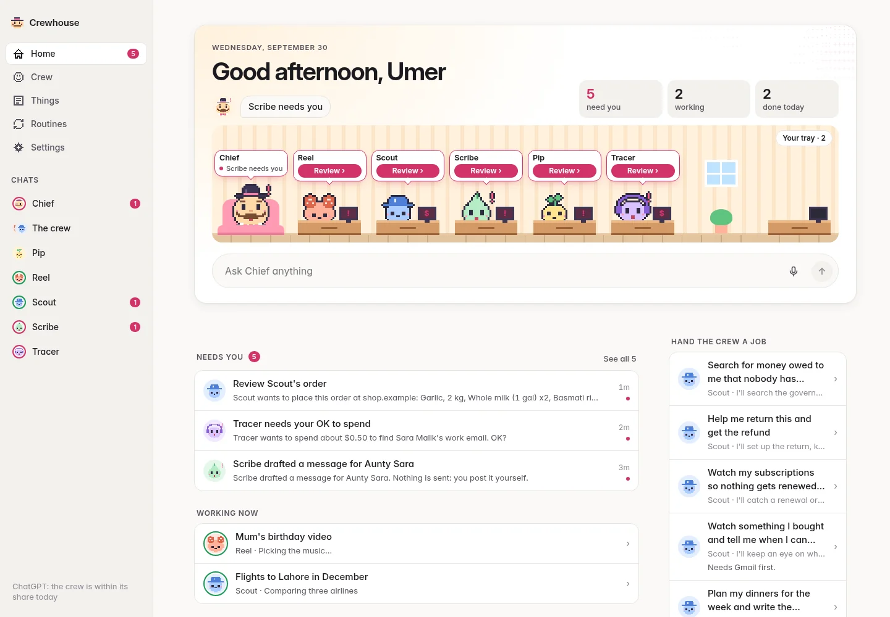
  </picture><br/>
  <sub>Every picture here is the real app running. The person in it (Umer and his crew) and its messages come from the app's built-in demo, so no one's real data is shown.</sub>
</p>

## Download

- **Phone app (Android, preview):** [CREWHOUSE-APK-1.0.0-preview.20261001.16.apk](https://github.com/umeranjum17/crewhouse/releases/download/v1.0.0-preview.20261001.16/CREWHOUSE-APK-1.0.0-preview.20261001.16.apk) — v1.0.0-preview.20261001.16, ~90 MB, SHA-256 `bae601ad5cf62c9e226d8cced397bb9aba18bebddc41b3cf9e8a6818c21598c6`. Debug-signed preview; updates the previous preview in place. Pair it under Settings, Phones on the computer (see [TRY-IT.md](TRY-IT.md#3-the-phone-app)).
- **Computer:** Crewhouse is self-hosted and installs from source — see [Quick start](#quick-start) (`git clone` + `./crewhouse setup`). There is no desktop installer.

There is no full release yet, only phone-app previews, so GitHub's `/releases/latest` links don't apply (GitHub skips prereleases there). The link above names the current preview; for anything newer, check the [releases page](https://github.com/umeranjum17/crewhouse/releases).

### Desktop bar (Omarchy or Waybar)

The computer owner's bar can show `2 working · 1 needs you`, using the same status as the phone. It shows only your own work, with counts in both the pill and tooltip. It clears when the crew is quiet or unreachable. Start Crewhouse normally; the bar only reads its status.

Replace `/absolute/path/crewhouse` with your source checkout and `/absolute/path/node` with your Node executable (`command -v node`, Node 22.22.3 or later). The bar runs [packaging/bar-pill.mjs](packaging/bar-pill.mjs) once every 10 seconds. For a different Crewhouse port, prefix the command with `CREWHOUSE_PORT=1234` and change the click address too.

For Omarchy's Quickshell bar, add this command module to an existing `bar.layout` section in `~/.config/omarchy/shell.json`:

```json
{
  "id": "crewhouse", "type": "command",
  "exec": "/absolute/path/node /absolute/path/crewhouse/packaging/bar-pill.mjs",
  "interval": 10,
  "onClick": "xdg-open http://127.0.0.1:7711"
}
```

For Waybar, add `custom/crewhouse` to `modules-right` (or another module list) and add this configuration:

```json
"custom/crewhouse": {
  "exec": "/absolute/path/node /absolute/path/crewhouse/packaging/bar-pill.mjs",
  "return-type": "json", "interval": 10,
  "on-click": "xdg-open http://127.0.0.1:7711"
}
```

This view is for your computer session. Clicking opens Crewhouse, where you can respond on each card.

## Why Crewhouse exists

Your to-do list is full of small jobs that take an afternoon each: chasing a refund, comparing flights, planning the week's dinners, writing the thank-you note. AI can do most of them now, but only if it can act, and nobody wants a chatbot sending emails or placing orders on its own.

Crewhouse is your personal assistant: a crew that does the work and a calm place to say yes. The helpers run on your own computer, with your own AI account sign-in. There is no Crewhouse server and no telemetry. What leaves your computer is what a job needs: your AI account, the pages and searches a helper opens, the apps you connected, and a content-free "Crewhouse has news" ping to your phone.

## See it in action

### Ask in your own words

Tell Chief what you need. He hands it to the helper who does that kind of work, or asks one short question when he isn't sure who that is. A job that should repeat ("weekdays 8am…") comes back as a routine card, and nothing is scheduled until you tap Start it.

<p align="center">
  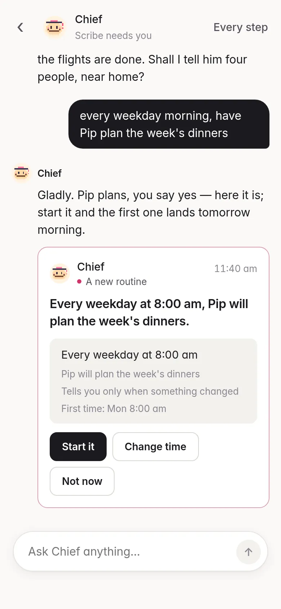
</p>

### It asks before it spends

Helpers work in their own folders without bothering you. Anything that costs money asks every time. The card is built from what the shop's own page shows, never from the model's description of it. Sending, deleting, or opening something of yours also asks first. Some of those can get a standing "Always OK" (say, adding events to your calendar). Spending never can, and neither can acting as you on a site you signed a helper in to. Set your monthly spending cap under Settings → Money; every purchase still asks first.

<p align="center">
  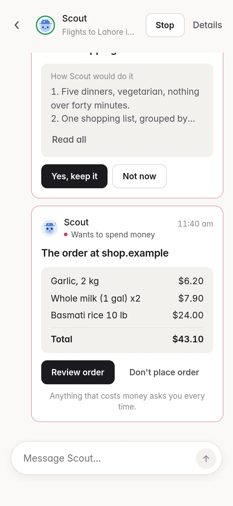
</p>

### Drafts, never sent behind your back

When a helper writes in your name (a reply to the school, a refund chase, a cancellation email), it arrives as a draft. You approve it or you don't, and nothing is sent either way. The helper hands you the words to send yourself.

<p align="center">
  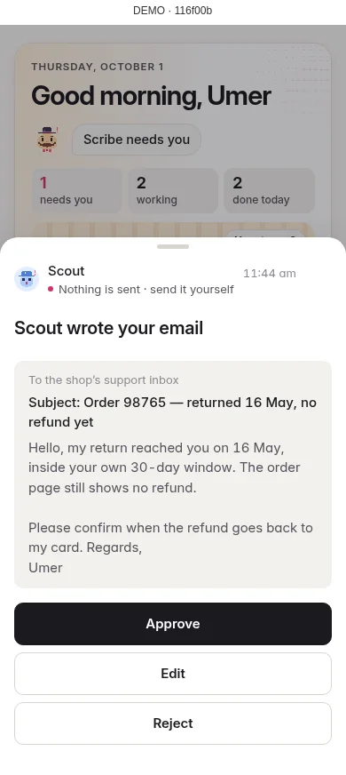
  <br /><em>DEMO</em>
</p>

### Real files, ready to use

Ask for a spreadsheet or a document and you get a real `.xlsx` or `.docx`. The helper describes what goes in it, and Crewhouse builds the file. You can open it right in the chat to read it, or download it.

<p align="center">
  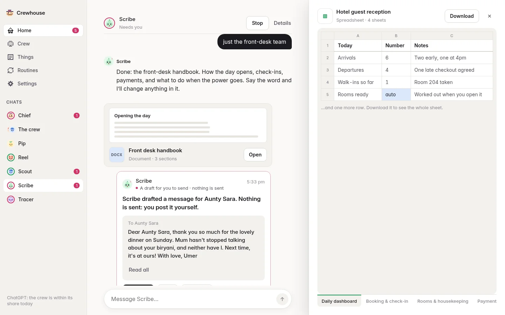
</p>

### A crew you can grow

Each helper has a soul (who it is, written by you), a job, its own skills and tools, and notes about the people it works for. Every note it keeps is a git commit you can undo. Add a helper from a template, or describe one to Chief and approve what he suggests.

<p align="center">
  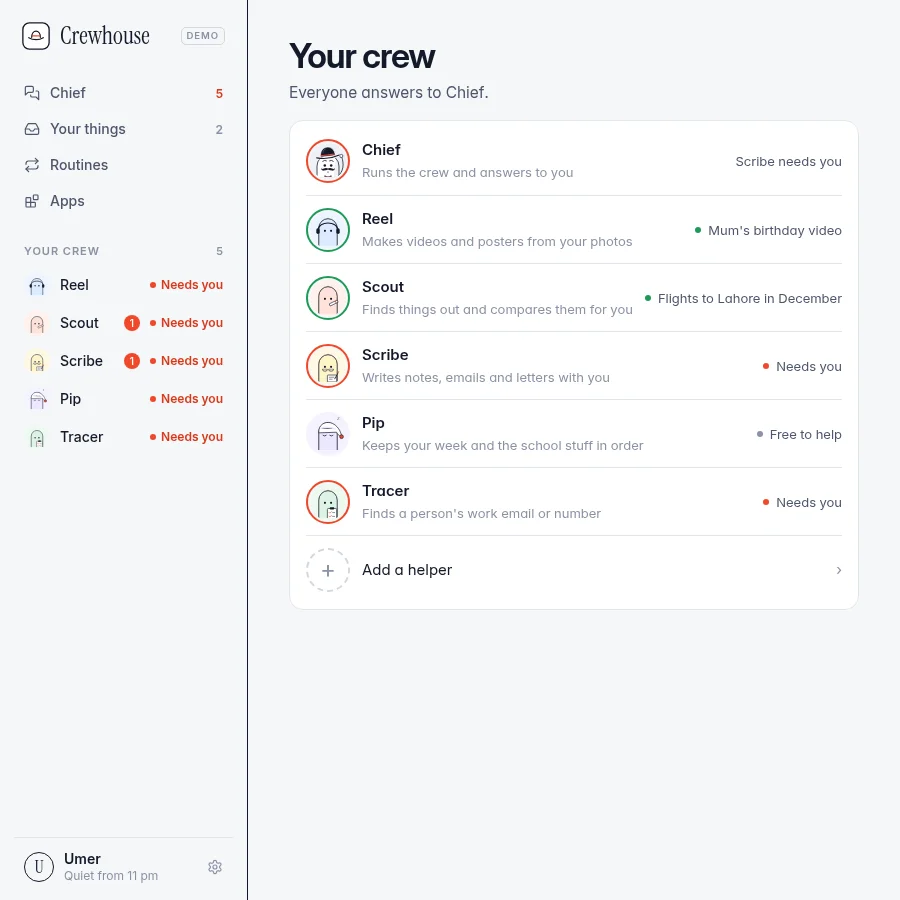
</p>

### Routines, without the setup

"Every Friday 5pm" or "weekdays 8am" become routines that run on the computer's own clock. If the computer slept through one, it catches up once. If the last run is still going, the next one is skipped, not stacked. A quiet check-in only tells you when something changed. Chief's morning digest (what finished, what needs you, what's coming) is written by Crewhouse itself, so it uses none of your account.

<p align="center">
  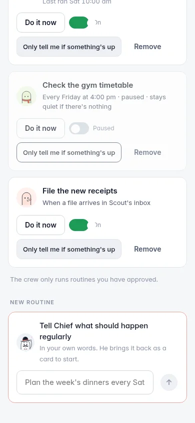
</p>

### Sign in once, inside the app

There are no terminal logins and no API keys. The first time you ask for something, Chief puts a **Sign in with…** button under his reply, naming the account the crew will think with. That account's own page opens, you say yes, and the job starts. A one-time code is the fallback. Every account the engine supports is under Settings, AI accounts ([the list](docs/supported-subscriptions.md)); each row says whether it uses a plan you already pay for or is charged to your account per use.

<p align="center">
  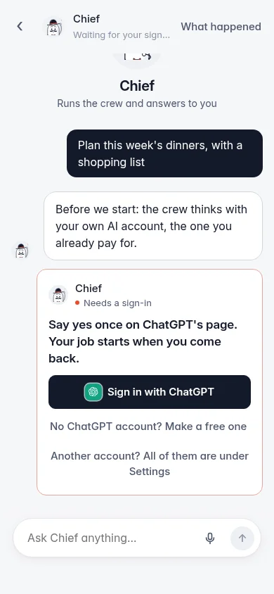
</p>

### Day and night, desk and pocket

The same app works at desktop and phone width, and switches to night colours in the evening. The Android app pairs with the computer by QR code or a typed code, over the home Wi-Fi, over Tailscale, or through a relay you run yourself. Its notifications only ever say "Crewhouse has news". The words themselves come over the encrypted link.

<p align="center">
  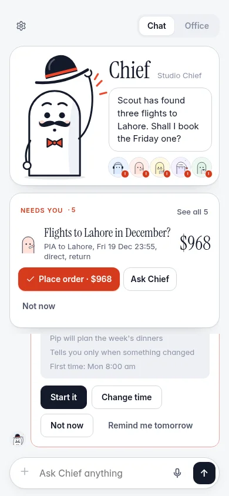
  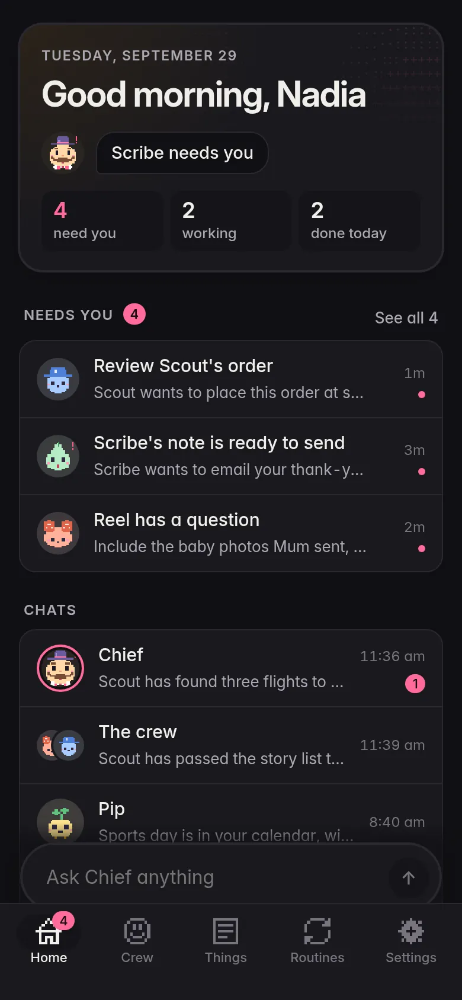
</p>

**Also included:**

- **Your personal assistant.** One install is for you and your crew of helpers. Ask in your own words, read what comes back, and tap yes when a helper needs you. No technical knowledge needed to use it.
- **Each helper's own computer (Linux).** A helper with the Computer tool gets its own virtual display and browser, never yours. Watch it live, take the wheel (the helper pauses until you hand it back), or show it how to do a task so it can keep the steps as a skill.
- **Connected apps.** Connect your Notion, Canva, Google Drive, Calendar or Gmail. A helper that needs one asks with a Connect card in the chat. Reading happens straight away; changing or sending asks first. Google needs a one-time setup under Settings → Google setup on your computer ([docs/google-setup.md](docs/google-setup.md)).
- **Picks up after a restart.** Stop the computer mid-job, start it again, and the job carries on in the same conversation. A question waiting on you is still there.
- **Learns how you work.** After a long job the helper can keep what it learned as a skill. You can review or forget what it kept on its page, and Settings can switch this off. Background learning stays out of your chats.

Existing shared installs must first update through the one-person migration release (P1, `bc37c20`) before installing this build; otherwise startup refuses without changing their live data. That release upgrades to the person who set them up (person 1). Before changing live data, the P1 release saves the full database as `crew-before-one-person.db` in its state folder. Other people's jobs, messages and phones leave the live install; their files and sign-ins stay untouched on disk. Your sign-ins, connections, memory, phones and settings keep working. Watch baselines for removed routines are kept with a `.before-one-person` suffix so a new routine starts fresh. Downgrading to a build before this migration is unsupported: an older build could reuse a former person's id and files.

Keep the phone app up to date alongside the computer. An older preview shows “Get the latest Crewhouse app to keep chatting.” Open Chief’s chat and tap the sentence to download the current preview.

## Quick start

Crewhouse is self-hosted only. There is no hosted service and no account with us. Your personal assistant runs on your computer. You use it from a browser or the phone app.

You need **Linux** and **[Node.js](https://nodejs.org) 22.22.3 or later**. Nothing else: the AI engine ships inside Crewhouse, and you sign in from the app.

```bash
git clone https://github.com/umeranjum17/crewhouse && cd crewhouse
./crewhouse setup     # installs dependencies and the engine, builds the web app, checks the machine
./crewhouse start     # starts Crewhouse and prints the address
```

Open **http://127.0.0.1:7711**. Chief greets you and offers three things to take off your plate. Tap one, then **Sign in with…** under his reply, and the crew starts work.

<p align="center">
  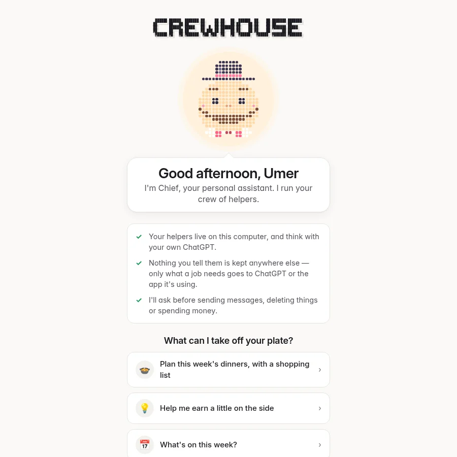
</p>

When run in a terminal, `setup` asks two things:

- Whether to install the helpers' pinned tools now: their web browser with its own Chromium (about 170 MB), MarkItDown and yt-dlp. You can do this later with `./crewhouse tools install`.
- Whether Crewhouse should start by itself when you log in (a systemd user service). You can change this later with `./crewhouse autostart on|off`.

`./crewhouse doctor` shows what's installed and what's missing. The helpers' sandboxed shell needs [bubblewrap](https://github.com/containers/bubblewrap), and their own screens need Xvfb and Chromium. Crewhouse is built and tested on Linux. On macOS, helpers get no shell or screens, and autostart isn't available.

Engine sign-ins use BYOKit's sealing: the stopped engine keeps `auth-store.sealed`, and the next start restores the same login. Verified legacy copies and migration archives leave no plaintext credential copy. Crewhouse opts into the kit's dual wrapping: when available, the non-interactive OS keyring and an owner-only host key both wrap the saved sign-in, so later locked starts still work without prompting. A new install without keyring access uses the host key. An older keyring-only store needs one unlocked start to upgrade; until then the app asks you to unlock your password storage and try again. There is no plaintext fallback and no `CREWHOUSE_AUTH_KEY_FILE` requirement.

On Linux the kit's host key lives at `$XDG_STATE_HOME/byokit-<SHA-256 of crewhouse-engine>/host-key/` (the state root defaults to `~/.local/state`), beside the default `crewhouse/` state directory. Exclude that key directory from sealed-store backups; keep it separately for restores. Crewhouse does not copy or export it. Stop all writers before any kit-managed rotation; never edit key files yourself. Losing the original key or OS keyring makes the sealed store unrecoverable; an older build cannot open it.

App connections use the pinned BYOKit connection kit and its documented sealed-store adapter, with the same dual wrapping under the separate `crewhouse-connect` service. The person's `app-signins/` folder holds ciphertext, including the setup key and refreshed grants. Keep this service's host key separate from ciphertext backups too. Old app sign-ins and setup keys are not imported; reconnect apps after upgrading.

Credentials remain plaintext while the engine or migration doctor runs. Orderly shutdown waits for sealing; a crash is recovered on the next prepare once the old engine has stopped. Use encrypted storage and exclude live engine state from backups. This does not protect against another process running as the same OS user.

Everything Crewhouse writes lives in `~/.local/state/crewhouse/` (the database, the engine and saved sign-ins), `~/Crewhouse/` (helpers and what they know about each person) and `~/.local/share/crewhouse/tools/` (the tool kit). `./crewhouse uninstall` removes all of it, but keeps your crew folder unless you add `--all`.

| Command | What it does |
|---|---|
| `./crewhouse update` | Pulls, installs and restarts Crewhouse. Running work carries on. It refuses if the folder has local changes. |
| `./crewhouse doctor` | Shows what's installed and what's missing, and how to add it |
| `./crewhouse tools [install [ids...]]` | Lists or installs the helpers' tool kit |
| `./crewhouse autostart on\|off` | Turns starting at login on or off |
| `./crewhouse phones code \| pending \| approve '<two words>'` | Pairs a phone from the terminal |
| `./crewhouse uninstall [--all] [--yes]` | Removes what Crewhouse installed |

**The phone app** (Android) is in preview. Debug-signed APKs are on the [releases page](https://github.com/umeranjum17/crewhouse/releases). Pair it under Settings, Phones on the computer ([TRY-IT.md](TRY-IT.md#3-the-phone-app)), or ask Chief to add your phone. Every paired phone uses your crew; you can also add one that only watches. Quiet hours hold notifications across a restart and send one when they end. To reach the computer away from home, use Tailscale or [run your own relay](relay/README.md). There's no built-in one.

Phone notifications currently use raw Expo registration, delivery and a local quiet-hours outbox: migration debt pending published BYOKit notification contracts. Content-free news, phone grant authorization and quiet-hour preferences remain Crewhouse policy. Android status uses the published `@byokit/statusbar` 0.1.0 kit; the direct iOS Live Activity integration still needs a kit.

## Under the hood

```
 browser or phone app
        │ HTTP + WebSocket on 127.0.0.1 · the phone over an encrypted link
        ▼
 crewd ── SQLite (state, append-only events, per-helper queue)
   │ supervised child process, loopback + token
   ▼
 the bundled OpenClaw engine ── the retained m1 agent: your own sign-ins
   └─ one session per task ── every tool call passes crewd's gate first
        └─ tools: the helper's files, a sandboxed shell, the web, its own browser, the person's connected apps
```

<details>
<summary><strong>How the pieces fit</strong></summary>

- **crewd** (`src/`) is one Node process with one SQLite file. Every change is an event, and the web app and paired phones follow one event stream for the person. Model choices and engine failures keep their internal details out of that stream, including historical payloads. The web app reads crewd only through `web/src/adapter.ts`. The contract is [docs/ui-contract.md](docs/ui-contract.md).
- **The engine** is [OpenClaw](https://www.npmjs.com/package/openclaw), pinned and installed with scripts off by the pinned npm [`@byokit/openclaw`](https://github.com/umeranjum17/byokit) kit's `prepare()` during setup, update, packaging and CI (`scripts/prepare-engine.mjs`), and run through `src/openclaw/runtime.ts` as a child process with an environment built from nothing. It uses loopback only, with token auth, and channels, Control UI, Tailscale and mDNS are all off. Crewhouse never reads or runs your own agent setup (`~/.openclaw`, `~/.codex`, `~/.pi` and the like). `test/openclaw.test.ts` and `test/isolation.test.ts` check that on every CI run.
- **Tasks** are engine sessions on the retained `m1` agent, keyed by helper and task. A restart, or switching to another account when one hits its limit, continues the same session.
- **The gate** (`src/policy.ts`) decides every tool call from the tool and its input, never from the model's words. Unknown tools fail closed. Sign-in and key folders are refused outright. A question waits a few minutes, then the helper parks, and your later answer resumes it.
- **The shell** currently runs in bubblewrap (sandbox and network-proxy foundations are BYOKit migration debt): `/usr` and `/etc` read-only, an empty `/home` with only the helper's folder in it, and no inherited environment. A template can restrict a helper to a list of hosts, reached only through crewd's allowlisting proxy (`src/net.ts`).
- **On disk:** a helper is `~/Crewhouse/bots/<id>/` (`soul.md`, `AGENTS.md` for its job, `bot.json`, `skills/`, `files/`). What the crew knows about a person is in `~/Crewhouse/people/<id>/` (`about.md` and one `notes/<helper>.md` per helper), and every change is a git commit.
- **Tools** are curated manifests (raw installation/execution, browser SDKs and document libraries are BYOKit migration debt), one manifest per tool in `tools/<id>/tool.json`, saying what it does, its licence, and when it asks you first. Pinned tools install into Crewhouse's own folder, never globally and never with sudo. The browser is [playwright-axi](https://github.com/brycehamrick/playwright-axi) with its own Chromium. Command-line programs that use your own sign-in are typed tools, never shell.
- **Helpers' screens** (`src/desktop.ts`, desktop/streaming infrastructure is BYOKit migration debt) are one Xvfb display and one Chromium per helper, streamed to you with [desklink](https://www.npmjs.com/package/@desklink/host). DevTools goes over a pipe that crewd relays at a secret loopback path, so no other helper's shell can reach it.
- **Routing** a message to Chief uses [`@byokit/decide`](https://www.npmjs.com/package/@byokit/decide): rules for the obvious cases, then the person's own AI. The phone link and relay use [`@byokit/link`](https://www.npmjs.com/package/@byokit/link) and [`@byokit/relay`](https://www.npmjs.com/package/@byokit/relay).
- **Settings by environment:** `CREWHOUSE_STATE_DIR`, `CREWHOUSE_CREW_DIR`, `CREWHOUSE_TOOLS_DIR`, `CREWHOUSE_PORT` (default 7711), `CREWHOUSE_MAX_CONCURRENT` (default 3), `CREWHOUSE_RELAY`, and `CREWHOUSE_ENGINE=stub` (the scripted test model).

</details>

## Not yet

- An iPhone build, and a signed Android release. The iPhone app is set up (share sheet, shortcuts, Control Center buttons in `mobile/targets/actions`, and the crew on the Lock Screen and Dynamic Island in `mobile/src/island.ios.tsx`) but has never been built or signed. The Android app is a debug-signed preview, and its push notifications need the builder's own push credential. Editing a helper, signing in and connecting apps stay on the computer.
- Helpers' shell and screens on macOS and Windows, and a desktop download. Today you install from source.
- Signing in from the phone. For now, everyone signs in on the computer, in the browser, with a one-time code as the fallback.
- A per-person login. Anyone at the computer can pick who they are.

## Development

```bash
npm run check        # typecheck (tsc, strict)
./crewhouse test     # the suite, on a scripted model: no account, no network, no quota
```

`./crewhouse test` runs in a throwaway HOME and then checks that your own `~/.pi` sign-ins, settings and extensions are unchanged, byte for byte. CI runs the typecheck, the suite (`npm test`) and the web build on Node 22.22.3 and 24. Project conventions for contributors and coding agents are in [AGENTS.md](AGENTS.md).

## License

Crewhouse is licensed under the [Apache License 2.0](LICENSE). Third-party notices are in [NOTICE](NOTICE). Each person's AI account stays subject to its provider's terms.
